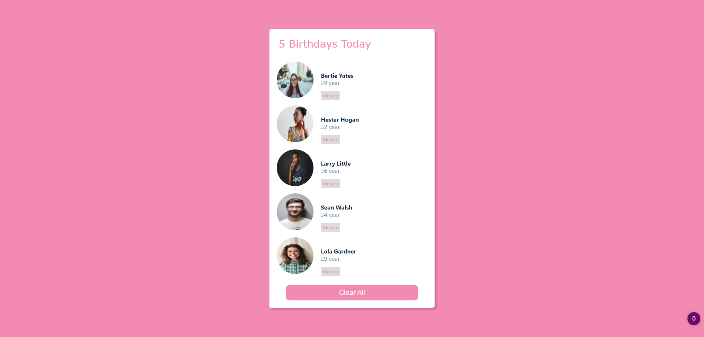

  

<h3>Birthday Reminder</h3>

<!-- TABLE OF CONTENTS -->

  
Table of Contents

  <ol>
    <li>
      <a href="#about-the-project">About The Project</a>
      <ul>
          <li><a href="#built-with">Built With</a></li>
          <li><a href="#getting-started">Getting Started</a></li>
          <li><a href="#acknowledgments">Acknowledgments</a></li>
         </ul>
    </li>      
  </ol>

## About The Project

<!-- [![Product Name Screen Shot][product-screenshot]](https://example.com) -->

Repo_name:

Hosted link: https://ijayhub.github.io/Birthday-reminder/

project_title: Birthday Reminder Web App

project_description: This is an app that reminds you of people's events, such as birthdays.

(<a href="#top">back to top</a>)

### Built With

* [React](https://reactjs.org/)

(<a href="#top">back to top</a>)

## Getting Started
To get a local copy up and running follow these simple example steps:
## Available Scripts

In the project directory, you can run:

 ### `npm start`

Runs the app in the development mode.\
Open [http://localhost:3000](http://localhost:3000) to view it in your browser.

The page will reload when you make changes.\
You may also see any lint errors in the console.

(<a href="#top">back to top</a>)

## Acknowledgments
* [John Smilga](https://react-projects.netlify.app/)

(<a href="#top">back to top</a>)

 

